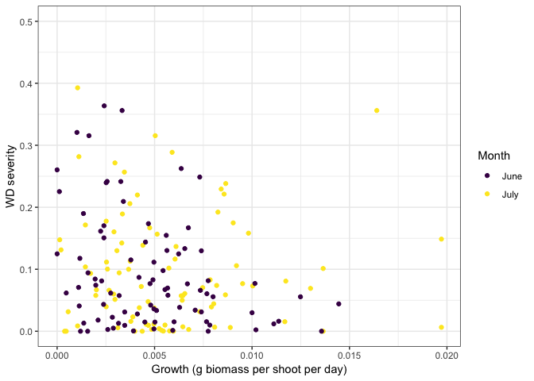
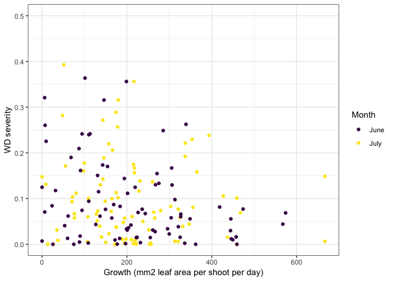
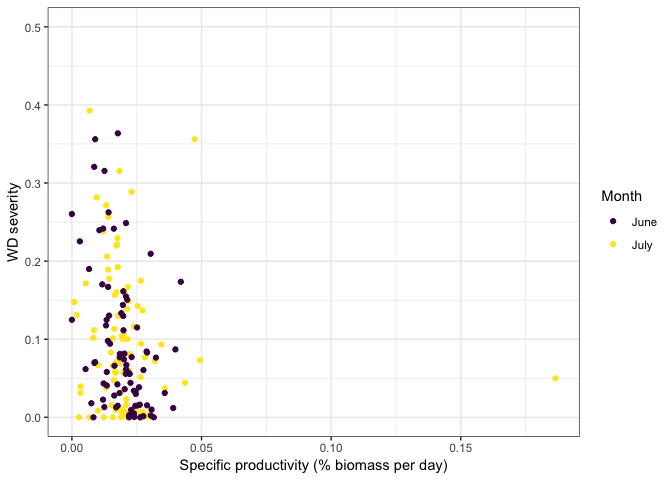
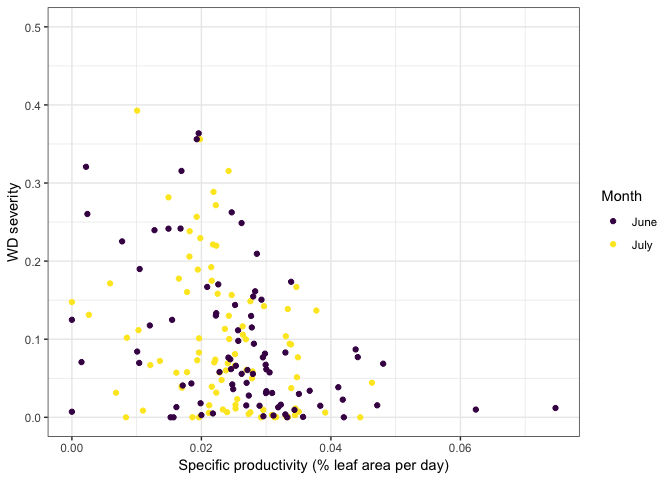

DiseaseGrowth
================
LRA
1/26/2020

### Comparing disease severity to growth rates

These are plots of WD severity as a function of plant growth metrics.

Severity is measured at the shoot level by EELISA.

Plant growth are from pin-prick productivity measurements.

All measurements come from one site (Fourth of July in San Juan Islands,
WA).

<!-- --><!-- --><!-- --><!-- -->
