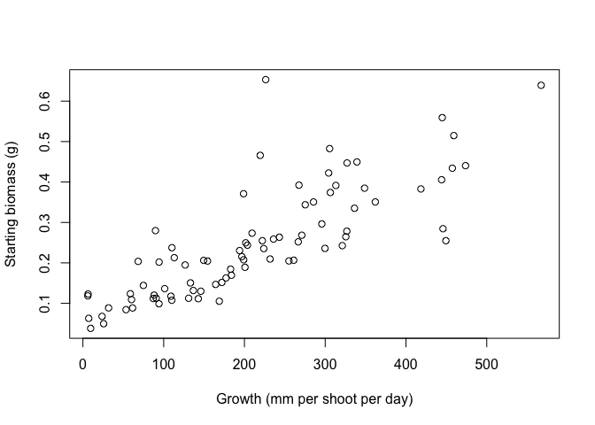

ExploratoryAnalysis1
================
LRA
12/17/2019

## June in situ productivity and prevelance

``` r
growth <- read.csv("InSituGrowthData.csv")
growth <- na.omit(growth)
growth$Prev <- as.factor(growth$Prev)
cdplot(Prev~mm2.sh.d,data=growth,xlab = "Growth (mm per shoot per day)",ylab="Prevelance")
```

<!-- -->

At the shoot level, there’s a slightly higher probability (~0.4) that
the leaves will be infected for slower-growing shoots, while faster
growing shoots have a slightly lower probability of infection (~0.2)

``` r
leaf <- read.csv("LeafGrowth.csv")
leaf$Prev <- as.factor(leaf$Prev)
cdplot(Prev~mm2.l.d,data=leaf,xlab = "Growth (mm per leaf per day)",ylab="Prevelance")
```

<!-- -->

At the leaf level, faster growing leaves are much less likely to be
infected. This result is because the youngest leaves are the fastest
growing and least likely to be
infected.

``` r
plot(Old.g~mm2.sh.d,data=growth,xlab="Growth (mm per shoot per day)",ylab="Starting biomass (g)")
```

<!-- -->

Unsurprisingly, bigger shoots have higher growth rates
