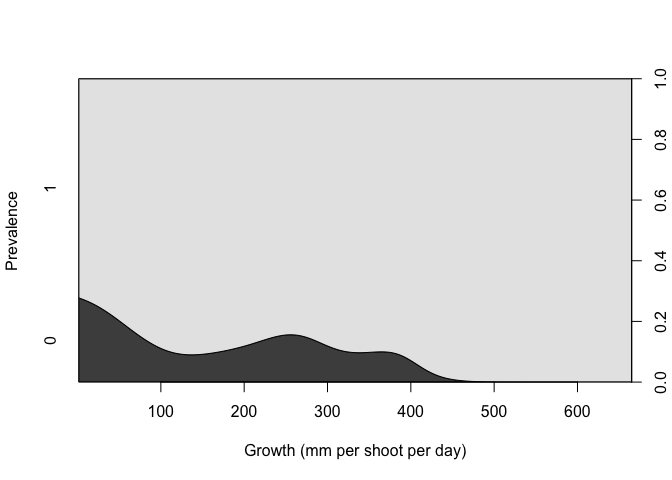
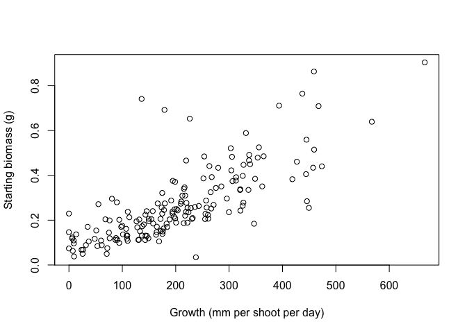
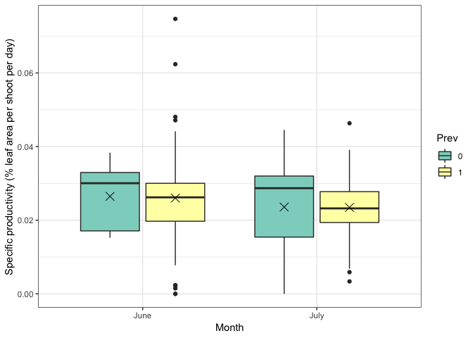
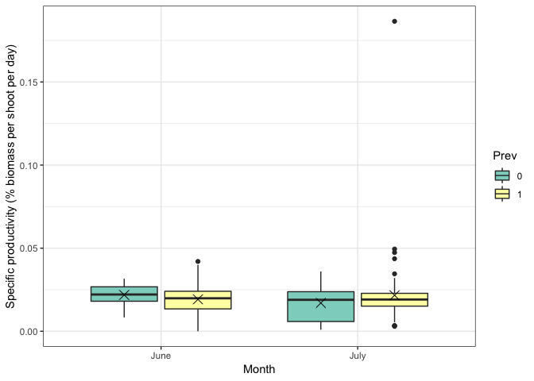

ExploratoryAnalysis2
================
LRA
1/9/2020

## June + July in situ prevalence data

``` r
combo <- read.csv("CombinedGrowthData.csv")
combo$Prev <- as.factor(combo$Prev)
combo$Month <- ordered(combo$Month,levels=month_order)
cdplot(Prev~mm2.sh.d,data=combo,xlab = "Growth (mm per shoot per day)",ylab="Prevalence")
```

<!-- -->

At the shoot level, faster growing (and larger) shoots are more likely
to be infected. But, with such high prevalence, the main takeaway is
that all shoots are likely to be infected.

``` r
leaf <- read.csv("LeafGrowth.csv")
leaf$Prev <- as.factor(leaf$Prev)
cdplot(Prev~mm2.l.d,data=leaf,xlab = "Growth (mm per leaf per day)",ylab="Prevalence")
```

<!-- -->

At the leaf level, faster growing leaves are much less likely to be
infected. This result is because the youngest leaves are the fastest
growing and least likely to be infected. Think about controlling for age
(leaf
number)

``` r
plot(Old.g~mm2.sh.d,data=combo,xlab="Growth (mm per shoot per day)",ylab="Starting biomass (g)")
```

<!-- -->

Unsurprisingly, bigger shoots have faster growth rates

``` r
combo_summ <- combo %>%
  group_by(Month,Transect)%>%
  summarise(NumHealthy=length(which(Prev==0)),NumDisease=length(which(Prev==1)),
            PerDisease=NumDisease/(NumDisease+NumHealthy))
combo_summ
```

    ## # A tibble: 6 x 5
    ## # Groups:   Month [?]
    ##   Month Transect NumHealthy NumDisease PerDisease
    ##   <ord> <fct>         <int>      <int>      <dbl>
    ## 1 June  A                 1         28      0.966
    ## 2 June  B                 6         22      0.786
    ## 3 June  C                 4         25      0.862
    ## 4 July  A                 5         25      0.833
    ## 5 July  B                 4         26      0.867
    ## 6 July  C                 3         27      0.9

``` r
combo_summ %>% group_by(Month) %>% summarise(meanPerDisease=mean(PerDisease),sd=sd(PerDisease))
```

    ## # A tibble: 2 x 3
    ##   Month meanPerDisease     sd
    ##   <ord>          <dbl>  <dbl>
    ## 1 June           0.871 0.0902
    ## 2 July           0.867 0.0333

Very few healthy shoots in either month (11 in June, 12 in July). More
variation in infection rate in June (sd is between transects), but mean
prevalence is equivalent.

``` r
ggplot(data=combo,aes(x=Month,y=sp.prod.mm2,fill=Prev))+geom_boxplot()+
  stat_summary(fun.y=mean, geom="point", shape=4, size=4, color="black",
               position=position_dodge(width = 0.75),show.legend = FALSE)+
  xlab("Month")+
  ylab("Specific productivity (% leaf area per shoot per day)")+
  scale_fill_brewer(type="qual",palette = "Set3")+
  theme_bw()
```

<!-- -->

``` r
ggplot(data=combo,aes(x=Month,y=sp.prod.g,fill=Prev))+geom_boxplot()+
  stat_summary(fun.y=mean, geom="point", shape=4, size=4, color="black",
               position=position_dodge(width = 0.75),show.legend = FALSE)+
  xlab("Month")+
  ylab("Specific productivity (% biomass per shoot per day)")+
  scale_fill_brewer(type="qual",palette = "Set3")+
  theme_bw()
```

<!-- -->

Minimal differences in specific productivity (as leaf area or biomass)
between June and July. Means are equivalent between diseased and healthy
plants (but remember for boxplots, n=~80 for diseased, n=~10 for
healthy)
